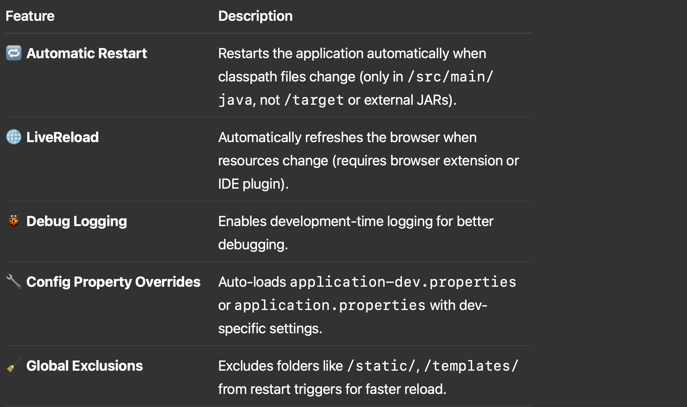
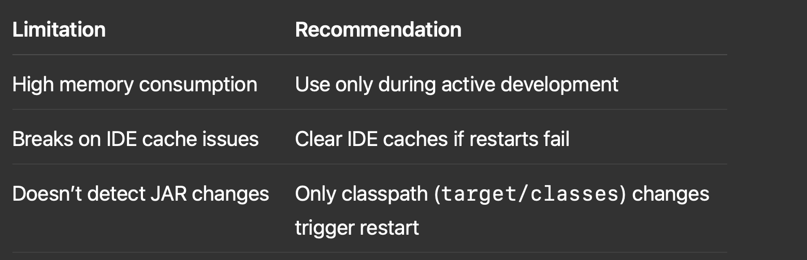
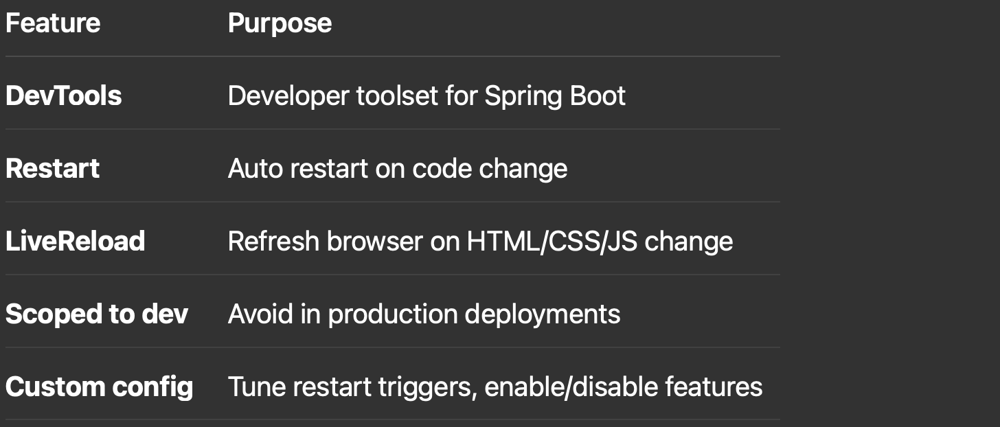

## 🧱 Spring Boot DevTools - Core Concepts
Absolutely! As an experienced Java Developer, having a solid grasp of Spring Boot DevTools is essential for improving developer productivity and speeding up application development cycles. Below is a complete overview that covers core concepts, best practices, and a real-world use case.

⸻

### ✅ I. What is Spring Boot DevTools?

Spring Boot DevTools is a developer-friendly toolset built into the Spring Boot ecosystem that provides:
	•	Automatic restart
	•	LiveReload
	•	Enhanced debugging
	•	Development-time configurations

It should never be used in production, only in local development environments.

⸻

### ✅ II. Core Concepts & Features



⸻

### ✅ III. Enabling DevTools in a Spring Boot Project

🔹 1. Maven Dependency
```xml
<dependency>
    <groupId>org.springframework.boot</groupId>
    <artifactId>spring-boot-devtools</artifactId>
    <scope>runtime</scope> <!-- or 'compile' for legacy tools -->
    <optional>true</optional>
</dependency>
```

🔹 2. Gradle
```java
dependencies {
    developmentOnly("org.springframework.boot:spring-boot-devtools")
}
```

⸻

### ✅ IV. Best Practices



⸻

### ✅ V. Configuration Options (application.properties)
```java
# Disable restart (if needed)
spring.devtools.restart.enabled=false

# Exclude static files from triggering restart
spring.devtools.restart.exclude=static/**,public/**,templates/**

# Enable LiveReload server
spring.devtools.livereload.enabled=true

# Specify custom restart trigger folders
spring.devtools.restart.additional-paths=src/main/java/com/example/service
```

⸻

### ✅ VI. Real-World Use Case: API-Driven Web App with Auto-Restart

🧩 Scenario:

You’re developing a configuration settings dashboard with REST APIs and a Thymeleaf front-end. You want:
	•	Quick restart when API classes change
	•	Live browser reload on HTML/JS changes
	•	Development-only logging

🧩 DevTools Implementation Steps:

🔸 1. Enable DevTools in pom.xml (or build.gradle)

🔸 2. Example Controller
```java
@RestController
@RequestMapping("/api/config")
public class ConfigController {
    
    @GetMapping
    public String getSetting() {
        return "My Config Value: " + System.currentTimeMillis();
    }
}
```
🔸 3. Static HTML (Thymeleaf or plain)

src/main/resources/templates/index.html
```xml
<!DOCTYPE html>
<html>
<head><title>Config UI</title></head>
<body>
    <h1 th:text="'Value: ' + ${value}"></h1>
</body>
</html>
```

🔸 4. Dev Settings in application.properties
```properties
spring.devtools.restart.exclude=static/**,templates/**
spring.thymeleaf.cache=false
```

### ✅ Benefit: You can edit your ConfigController or Service logic and Spring Boot will auto-restart the app with updated logic. Browser will reload without needing a manual refresh.

⸻

### ✅ VII. Limitations and Gotchas


⸻

### ✅ VIII. Summary



⸻