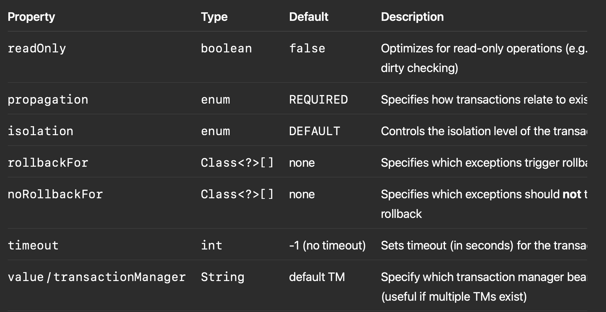

# ☕ Spring Data JPA Core Concepts —

Spring Data JPA simplifies data access in Spring applications by eliminating boilerplate code and providing powerful abstractions for CRUD operations, query generation, and transaction management.

---

## 🔧 Core Annotations and Concepts

### 1. `@Repository`

**Purpose:** Marks an interface or class as a Spring-managed data repository.

```java
@Repository
public interface UserRepository extends JpaRepository<User, Long> {
  User findByLoginName(String loginName);
}
```

**Use Case:**
- Automatically provides CRUD operations without implementing any method.
- Converts JPA exceptions into Spring's `DataAccessException` hierarchy.

---

### 2. `@Table`

**Purpose:** Maps a Java class to a specific database table.

```java
@Entity
@Table(name = "users")
public class User {
  @Id @GeneratedValue
  private Long id;
  private String loginName;
  // ...
}
```

**Use Case:**
- Customize table name (especially if different from class name).
- Add constraints like `@UniqueConstraint` via attributes.

---

### 3. `@Transactional`

**Purpose:** Declares the scope of a single database transaction.

```java
@Service
public class UserService {

  @Autowired private UserRepository repo;

  @Transactional
  public void registerUser(User user) {
    repo.save(user);
    // perform other operations atomically
  }
}
```

**Use Case:**
- Ensures atomicity — either all operations within the method succeed, or none do.
- Can be set at method or class level.

---

### 4. `@Query`

**Purpose:** Define custom SQL or JPQL queries directly on repository methods.

```java
@Query("SELECT u FROM User u WHERE u.loginName = :login")
User findByLogin(@Param("login") String login);
```

**Use Case:**
- When method name query derivation is insufficient.
- Use native SQL with `nativeQuery = true`.

---

## ❓ Common Spring Data JPA Interview Questions

### Q1: What is the difference between `CrudRepository`, `JpaRepository`, and `PagingAndSortingRepository`?

- `CrudRepository`: Basic CRUD methods.
- `PagingAndSortingRepository`: Adds pagination and sorting.
- `JpaRepository`: Adds JPA-specific features (e.g., batch delete, flush).

---

### Q2: How does Spring Data JPA generate queries from method names?

```java
User findByEmailAndStatus(String email, String status);
```

Generates: 

```sql
SELECT * FROM users WHERE email = ? AND status = ?
```

---

### Q3: When would you use `@Transactional(readOnly = true)`?

- Optimize performance for read-only queries.

```java
@Transactional(readOnly = true)
public List<User> listUsers() {...}
```

---

### Q4: Can you use `@Modifying` with `@Query`?
Yes, for update/delete queries:

```java
@Modifying
@Query("UPDATE User u SET u.status = :status WHERE u.id = :id")
void updateStatus(@Param("id") Long id, @Param("status") String status);
```

---

### Q5: How do you handle N+1 query problem in Spring Data JPA?

- Use `@EntityGraph`, `JOIN FETCH`, or DTO projection.

```java
@Query("SELECT u FROM User u JOIN FETCH u.roles")
List<User> findAllWithRoles();
```

---

### ✅ Summary Table

| Annotation      | Purpose                                   | Use Case Example                              |
|----------------|-------------------------------------------|-----------------------------------------------|
| `@Repository`  | Marks DAO layer for Spring                | Interface for data access                     |
| `@Table`       | Maps class to DB table                    | `@Table(name = "users")`                     |
| `@Transactional` | Declares transaction boundaries         | Atomic user registration                      |
| `@Query`       | Custom SQL/JPQL queries                   | Complex or native queries                     |

---

Yes ✅ — the @Transactional annotation in Spring provides several properties (attributes) you can customize to control the transactional behavior of a method or class.

⸻

🔧 Common @Transactional Properties



⸻

🧪 Example Usages

1. Read-only transaction (improves performance)

```java
@Transactional(readOnly = true)
public List<User> getAllUsers() {
    return userRepository.findAll();
}
```

⸻

2. Custom rollback rule

```java
@Transactional(rollbackFor = CustomException.class)
public void processPayment() throws CustomException {
    // will rollback if CustomException is thrown
}
```

⸻

3. No rollback for checked exception

```java
@Transactional(noRollbackFor = IOException.class)
public void uploadFile() throws IOException {
    // even if IOException occurs, transaction will not roll back
}
```

⸻

4. Set timeout and isolation level
```java
@Transactional(timeout = 5, isolation = Isolation.SERIALIZABLE)
public void updateStock() {
    // must complete in 5 seconds with strict isolation
}
```

⸻

5. Define propagation behavior

```java
@Transactional(propagation = Propagation.REQUIRES_NEW)
public void logAuditEvent() {
    // starts a new independent transaction
}
```

⸻
# ☕ Spring Data JPA Core Concepts — Interview Prep Guide

Spring Data JPA simplifies data access in Spring applications by eliminating boilerplate code and providing powerful abstractions for CRUD operations, query generation, and transaction management.

---

## 🔧 Core Annotations and Concepts

### 1. `@Repository`

**Purpose:** Marks an interface or class as a Spring-managed data repository.

```java
@Repository
public interface UserRepository extends JpaRepository<User, Long> {
  User findByLoginName(String loginName);
}
```

**Use Case:**
- Automatically provides CRUD operations without implementing any method.
- Converts JPA exceptions into Spring's `DataAccessException` hierarchy.

---

### 2. `@Table`

**Purpose:** Maps a Java class to a specific database table.

```java
@Entity
@Table(name = "users")
public class User {
  @Id @GeneratedValue
  private Long id;
  private String loginName;
  // ...
}
```

**Use Case:**
- Customize table name (especially if different from class name).
- Add constraints like `@UniqueConstraint` via attributes.

---

### 3. `@Transactional`

**Purpose:** Declares the scope of a single database transaction.

**Common Properties and Use Cases:**

| Property        | Type        | Description                                                                 |
|----------------|-------------|-----------------------------------------------------------------------------|
| `readOnly`     | boolean     | Optimizes read-only operations (e.g., disables dirty checking)              |
| `rollbackFor`  | Class<?>[]  | Rollback transaction for specified exception types                          |
| `noRollbackFor`| Class<?>[]  | Do **not** rollback for specified exceptions                                |
| `propagation`  | Propagation | Defines how the method should behave relative to existing transactions      |
| `isolation`    | Isolation   | Controls how data access is isolated between transactions                   |
| `timeout`      | int         | Sets the transaction timeout (in seconds)                                   |

#### a) Read-Only Transaction

```java
@Transactional(readOnly = true)
public List<User> getAllUsers() {
    return userRepository.findAll();
}
```

#### b) Rollback for a Specific Exception

```java
@Transactional(rollbackFor = CustomException.class)
public void registerUser(User user) throws CustomException {
    userRepository.save(user);
    throw new CustomException("Simulated failure");
}
```

#### c) Prevent Rollback for Checked Exception

```java
@Transactional(noRollbackFor = IOException.class)
public void uploadData() throws IOException {
    // won't rollback even if IOException is thrown
}
```

#### d) Custom Propagation

```java
@Transactional(propagation = Propagation.REQUIRES_NEW)
public void auditLog(String message) {
    auditRepository.save(new AuditLog(message));
}
```

#### e) Custom Isolation and Timeout

```java
@Transactional(isolation = Isolation.SERIALIZABLE, timeout = 10)
public void updateInventory(Long productId) {
    // Ensures full isolation and must complete in 10 seconds
}
```

---

### 4. `@Query`

**Purpose:** Define custom SQL or JPQL queries directly on repository methods.

```java
@Query("SELECT u FROM User u WHERE u.loginName = :login")
User findByLogin(@Param("login") String login);
```

**Use Case:**
- When method name query derivation is insufficient.
- Use native SQL with `nativeQuery = true`.

---

## ❓ Common Spring Data JPA Interview Questions

### Q1: What is the difference between `CrudRepository`, `JpaRepository`, and `PagingAndSortingRepository`?

- `CrudRepository`: Basic CRUD methods.
- `PagingAndSortingRepository`: Adds pagination and sorting.
- `JpaRepository`: Adds JPA-specific features (e.g., batch delete, flush).

---

### Q2: How does Spring Data JPA generate queries from method names?

```java
User findByEmailAndStatus(String email, String status);
```

Generates: 

```sql
SELECT * FROM users WHERE email = ? AND status = ?
```

---

### Q3: When would you use `@Transactional(readOnly = true)`?

- Optimize performance for read-only queries.

```java
@Transactional(readOnly = true)
public List<User> listUsers() {...}
```

---

### Q4: Can you use `@Modifying` with `@Query`?
Yes, for update/delete queries:

```java
@Modifying
@Query("UPDATE User u SET u.status = :status WHERE u.id = :id")
void updateStatus(@Param("id") Long id, @Param("status") String status);
```

---

### Q5: How do you handle N+1 query problem in Spring Data JPA?

- Use `@EntityGraph`, `JOIN FETCH`, or DTO projection.
```java
@Query("SELECT u FROM User u JOIN FETCH u.roles")
List<User> findAllWithRoles();
```

---

### ✅ Summary Table

| Annotation      | Purpose                                   | Use Case Example                              |
|----------------|-------------------------------------------|-----------------------------------------------|
| `@Repository`  | Marks DAO layer for Spring                | Interface for data access                     |
| `@Table`       | Maps class to DB table                    | `@Table(name = "users")`                     |
| `@Transactional` | Declares transaction boundaries         | Atomic user registration                      |
| `@Query`       | Custom SQL/JPQL queries                   | Complex or native queries                     |

---
