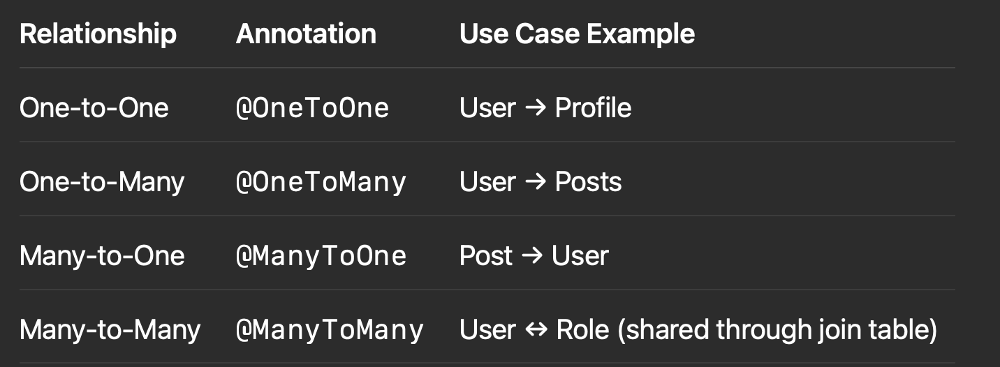

## 🧱 Spring Data JPA — One-to-One, One-to-Many, Many-to-One, and Many-to-Many — with detailed explanations

⸻


# 🔗 Spring Data JPA Relationships — Complete Guide

In Spring Data JPA, managing **relationships between database tables** is one of the most critical aspects of designing a scalable and normalized data model. Below are the most common types of relationships with explanations, use cases, and working code examples.

---

## 🧩 1. One-to-One (`@OneToOne`)

### 🔹 Use Case
A `User` has **one** `Profile`. Each `Profile` belongs to **one** `User`.

### ✅ Code Example

```java
@Entity
public class User {
  @Id @GeneratedValue private Long id;
  private String username;

  @OneToOne(cascade = CascadeType.ALL)
  @JoinColumn(name = "profile_id", referencedColumnName = "id")
  private Profile profile;
}

@Entity
public class Profile {
  @Id @GeneratedValue private Long id;
  private String bio;
}
```

⸻

🧩 2. One-to-Many (@OneToMany) and Many-to-One (@ManyToOne)

🔹 Use Case

A User can have many Posts. Each Post is associated with one User.

✅ Code Example

```java
@Entity
public class User {
  @Id @GeneratedValue private Long id;
  private String username;

  @OneToMany(mappedBy = "user", cascade = CascadeType.ALL)
  private List<Post> posts = new ArrayList<>();
}

@Entity
public class Post {
  @Id @GeneratedValue private Long id;
  private String content;

  @ManyToOne
  @JoinColumn(name = "user_id")
  private User user;
}
```

	•	mappedBy indicates the inverse side of the relationship.
	•	Avoid infinite recursion using @JsonManagedReference and @JsonBackReference if using Jackson.

⸻

🧩 3. Many-to-Many (@ManyToMany)

🔹 Use Case

A User can have many Roles, and a Role can belong to many Users.

✅ Code Example

```java
@Entity
public class User {
  @Id @GeneratedValue private Long id;
  private String username;

  @ManyToMany
  @JoinTable(
    name = "user_roles",
    joinColumns = @JoinColumn(name = "user_id"),
    inverseJoinColumns = @JoinColumn(name = "role_id")
  )
  private Set<Role> roles = new HashSet<>();
}

@Entity
public class Role {
  @Id @GeneratedValue private Long id;
  private String roleName;

  @ManyToMany(mappedBy = "roles")
  private Set<User> users = new HashSet<>();
}
```

	•	Intermediate join table user_roles is automatically handled.
	•	Use @JoinTable to define table/column mapping explicitly.

⸻

💡 Additional Best Practices

✅ Lazy vs Eager Fetching
	•	Use fetch = FetchType.LAZY for large collections or deep relations.
	•	EAGER is useful when you always need the child entity.

```java
@OneToMany(fetch = FetchType.LAZY)
private List<Order> orders;
```

⸻

✅ Bidirectional vs Unidirectional
	•	Unidirectional: Simplifies mapping; only one entity knows about the relationship.
	•	Bidirectional: Allows navigation from both sides. Use mappedBy to avoid circular references.

⸻

❓ Interview Questions

Q1: What is the difference between mappedBy and @JoinColumn?
	•	@JoinColumn is used on the owning side.
	•	mappedBy is used on the inverse side to indicate ownership belongs to the other entity.

Q2: How do you handle infinite recursion in JSON serialization?
	•	Use @JsonManagedReference and @JsonBackReference, or @JsonIgnore as needed.

Q3: Can you customize the join table name and column names?
	•	Yes, using @JoinTable, @JoinColumn, and @InverseJoinColumn.

⸻

✅ Summary Table




⸻

This knowledge is essential for designing real-world, normalized database schemas and mastering Spring Data JPA for scalable enterprise applications.
